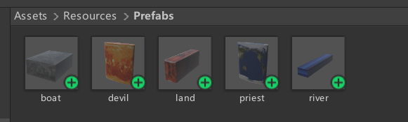
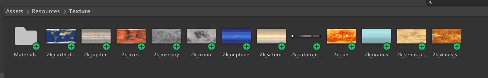

# 牧师与魔鬼小游戏

## 游戏规则

游戏开始时各有3名牧师和3名魔鬼在河岸同一侧，有一艘最多载两人的船供他们过河。当河岸任一侧魔鬼数量大于牧师数量时，牧师会被杀死，游戏失败；当所有角色成功转移至河对岸时，游戏成功。

## 游戏中提及的事物(Objects)

- 河岸(Land)
- 河流(River)
- 船(Boat)
- 牧师(Priest)
- 恶魔(Devil)

## 玩家动作表(规则表)

| 动作         | 条件                                             | 结果           |
| ------------ | ------------------------------------------------ | -------------- |
| 点击角色     | 游戏未结束，角色在岸上，点击的角色与船在同一岸边 | 角色上船       |
| 点击角色     | 游戏未结束，角色在船上                           | 角色上岸       |
| 点击船       | 游戏未结束，船上有至少一个角色                   | 船移动到另一侧 |
| 点击重试按钮 | 无                                               | 重新开始游戏   |

## 游戏演示


## 游戏对象预设制作

本项目使用的游戏对象预设均为简单的立方体或圆柱，纹理则直接采用[太阳系仿真](../solar_system/)项目中的星球纹理。

#### 预设目录


#### 纹理目录


## 游戏代码结构

本项目采用**MVC架构**开发。

- Models
  - BoatModel
  - LandModel
  - PositionModel
  - RiverModel
  - RoleModel
  - Click
  - ClickAction
- Views
  - UserGUI
- Controllers
  - FirstController
  - BoatController
  - LandModelController
  - RoleModelController
  - Move
  - MoveController
  - SSDirector
  - ISceneController
  - IUserAction
  - MoveCamera

## 部分重要代码展示

### Views

#### UserGUI.cs

UserGUI.cs集中全部用户界面，包括几个文字框和按钮，本项目的该脚本代码对于不同游戏状态的显示文本提供了 **setGameMessage()** 函数接口。

```Csharp
using System.Collections;
using System.Collections.Generic;
using UnityEngine;

public class UserGUI : MonoBehaviour
{
    private IUserAction userAction;
    string gameMessage;
    public int time;
    void Start()
    {
        time = 0;
        userAction = SSDirector.GetInstance().CurrentSenceController as IUserAction;
    }

    void OnGUI()
    {
        GUIStyle style_title = new GUIStyle();
        style_title.normal.textColor = Color.red;
        style_title.fontSize = 50;

        GUIStyle style_text = new GUIStyle();
        style_text.normal.textColor = Color.white;
        style_text.fontSize = 30;

        GUI.Label(new Rect(0, 0, 50, 200), "牧师与魔鬼", style_title);
        GUI.Label(new Rect(0, 80, 100, 50), "已用时间：" + time, style_text);

        if (GUI.Button(new Rect(0, 140, 100, 50), "重试"))
        {
            userAction.Restart();
        }

        GUI.Label(new Rect(0, 220, 100, 50), gameMessage, style_text);

    }

    public void setGameMessage(bool isWin)
    {
        if (isWin)
        {
            gameMessage = "胜利！";
        }
        else
        {
            gameMessage = "可惜失败！请重试！";
        }
    }

    public void resetGameMessage()
    {
        gameMessage = "";
    }
}
```

### Controllers

#### FirstController.cs

FirstController.cs是游戏的主控制器，其中 **Check()** 函数负责检查游戏输赢状态，该函数设置在每次船上所有角色上岸后调用，避免游戏状态在对象运动发生时改变。
```Csharp
using System.Collections;
using System.Collections.Generic;
using UnityEngine;

public class FirstController : MonoBehaviour, ISceneController, IUserAction
{
    private LandModelController rightLandRoleController;
    private LandModelController leftLandRoleController;
    private RiverModel riverModel;
    private BoatController boatRoleController;
    private RoleModelController[] roleModelControllers;
    private MoveController moveController;
    private bool isRuning;
    private float runningTime;


    void Awake()
    {
        SSDirector.GetInstance().CurrentSenceController = this;
        LoadResources();
        this.gameObject.AddComponent<UserGUI>();
    }

    public void LoadResources()
    {
        roleModelControllers = new RoleModelController[6];
        for (int i = 0; i < 6; i++)
        {
            roleModelControllers[i] = new RoleModelController();
            roleModelControllers[i].CreateRole(PositionModel.roles[i], i < 3 ? true : false, i);
        }

        leftLandRoleController = new LandModelController();
        leftLandRoleController.CreateLand("left_land", PositionModel.left_land);

        rightLandRoleController = new LandModelController();
        rightLandRoleController.CreateLand("right_land", PositionModel.right_land);

        foreach (RoleModelController roleModelController in roleModelControllers)
        {
            roleModelController.GetRoleModel().role.transform.localPosition = leftLandRoleController.AddRole(roleModelController.GetRoleModel());
        }

        riverModel = new RiverModel(PositionModel.river);

        boatRoleController = new BoatController();
        boatRoleController.CreateBoat(PositionModel.left_boat);

        moveController = new MoveController();

        isRuning = true;
        runningTime = 0;
    }

    public void MoveBoat()
    {
        if ((!isRuning) || moveController.GetIsMoving())
            return;

        if (boatRoleController.GetBoatModel().isRight)
            moveController.SetMove(PositionModel.left_boat, boatRoleController.GetBoatModel().boat);
        else
            moveController.SetMove(PositionModel.right_boat, boatRoleController.GetBoatModel().boat);

        boatRoleController.GetBoatModel().isRight = !boatRoleController.GetBoatModel().isRight;
    }

    public void MoveRole(RoleModel roleModel)
    {
        if ((!isRuning) || moveController.GetIsMoving())
            return;

        if (roleModel.isInBoat)
        {
            if (boatRoleController.GetBoatModel().isRight)
                moveController.SetMove(rightLandRoleController.AddRole(roleModel), roleModel.role);
            else
                moveController.SetMove(leftLandRoleController.AddRole(roleModel), roleModel.role);

            roleModel.isRight = boatRoleController.GetBoatModel().isRight;
            boatRoleController.RemoveRole(roleModel);

            if (boatRoleController.GetBoatModel().roles[0] == null && boatRoleController.GetBoatModel().roles[1] == null)
                Check();
        }
        else if (boatRoleController.GetBoatModel().isRight == roleModel.isRight)
        {
            if (roleModel.isRight)
            {
                rightLandRoleController.RemoveRole(roleModel);
            }
            else
            {
                leftLandRoleController.RemoveRole(roleModel);
            }
            moveController.SetMove(boatRoleController.AddRole(roleModel), roleModel.role);
        }

    }

    public void Restart()
    {
        runningTime = 0;
        this.gameObject.GetComponent<UserGUI>().resetGameMessage();

        leftLandRoleController.CreateLand("left_land", PositionModel.left_land);
        rightLandRoleController.CreateLand("right_land", PositionModel.right_land);

        for (int i = 0; i < 6; i++)
        {
            roleModelControllers[i].CreateRole(PositionModel.roles[i], i < 3 ? true : false, i);
            roleModelControllers[i].GetRoleModel().role.transform.localPosition = leftLandRoleController.AddRole(roleModelControllers[i].GetRoleModel());
        }
        boatRoleController.CreateBoat(PositionModel.left_boat);
        isRuning = true;
    }


    public void Check()
    {
        if (!isRuning)
            return;

        int leftPriestNum = leftLandRoleController.GetLandModel().priestNum;
        int leftDevilNum = leftLandRoleController.GetLandModel().devilNum;
        int rightPriestNum = rightLandRoleController.GetLandModel().priestNum;
        int rightDevilNum = rightLandRoleController.GetLandModel().devilNum;

        if (rightLandRoleController.GetLandModel().priestNum == 3 && rightLandRoleController.GetLandModel().devilNum == 3)
        {
            this.gameObject.GetComponent<UserGUI>().setGameMessage(true);
            isRuning = false;
        }
        else if ((leftPriestNum != 0 && leftPriestNum < leftDevilNum) || (rightPriestNum != 0 && rightPriestNum < rightDevilNum))
        {
            this.gameObject.GetComponent<UserGUI>().setGameMessage(false);
            isRuning = false;
        }

    }

    void Update()
    {
        if (isRuning)
        {
            runningTime += Time.deltaTime;
            this.gameObject.GetComponent<UserGUI>().time = (int)runningTime;
        }
    }

}
```

参考项目
> [Unity实现Priests and Deivls游戏
](https://github.com/StarashZero/3DGameDesign/tree/master/hw3)