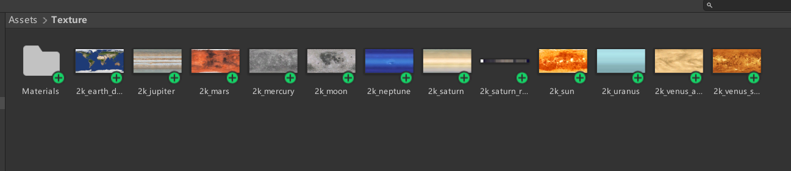
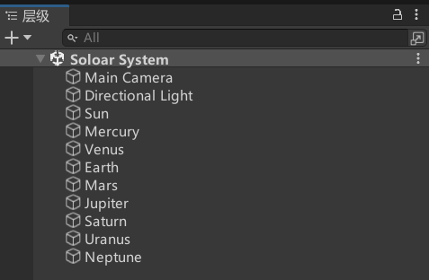
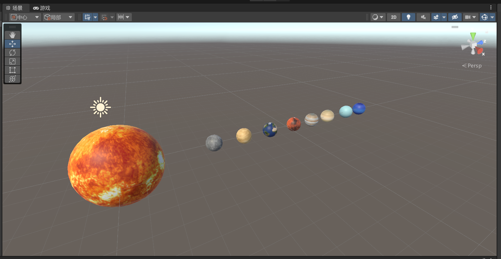
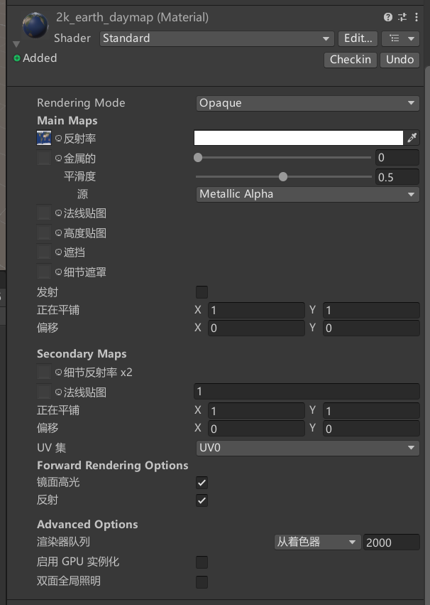
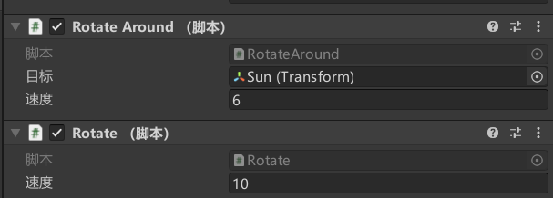
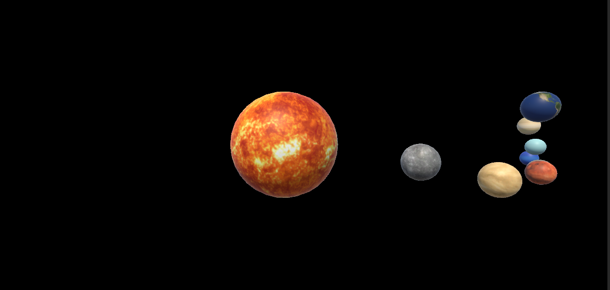

# 太阳系仿真

## 1. 下载纹理文件

[下载地址](https://www.solarsystemscope.com/textures/)

Texture目录


## 2. 布置太阳及各行星

太阳系游戏对象层次结构


太阳系模拟场景


为各星球添加纹路


## 3. 公转脚本代码

**共有变量**：旋转中心，公转速度，法向量。
对公转平面的法向量赋予随机值，以达到各行星公转平面各异的效果。

```Csharp
using System.Collections;
using System.Collections.Generic;
using UnityEngine;

public class RotateAround : MonoBehaviour
{
    public Transform target;
    public float speed;
    private float rx; //法向量


    // Start is called before the first frame update
    void Start()
    {
        rx = Random.Range(-20, 20);
    }

    // Update is called once per frame
    void Update()
    {
        Vector3 axis = new Vector3(rx, 100, 0);
        this.transform.RotateAround(target.position, axis, Time.deltaTime * speed);
    }
}
```

## 4. 自转脚本代码

共有变量：自转速度。
```Csharp
using System.Collections;
using System.Collections.Generic;
using UnityEngine;

public class Rotate : MonoBehaviour
{
    public float speed;

    // Start is called before the first frame update
    void Start()
    {
    }

    // Update is called once per frame
    void Update()
    {
        transform.Rotate(new Vector3(0, 1, 0) * Time.deltaTime * speed);
    }
}

```

## 5. 设置各行星公转、自转的参数

例图


其中各行星公转目标均设置为太阳，公转、自转速度按实际近似设置。

## 6. 运行演示

截图
